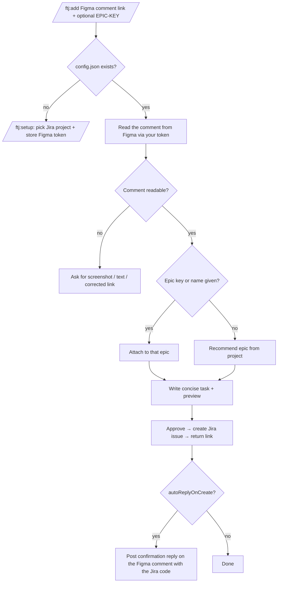

# figma-to-jira

A Claude Code plugin that reads a Figma comment from its link and turns it into a concise, well-formed Jira task.

## What & why

Design feedback lives in Figma comments. Turning that feedback into good Jira tasks is manual and inconsistent: someone rereads the thread, rewrites it as a user story, invents acceptance criteria, picks an issue type, finds the right epic, and pastes the Figma link back in. Everyone does it a little differently.

`figma-to-jira` collapses that into a single command. You give it the Figma comment link, and the plugin reads the comment for you, drafts a concise, outcome-focused user story, shows a preview, and — once you approve — creates the Jira issue through your own Atlassian connector and hands back the link. Jira access is your per-user OAuth connection in Claude; Figma access is your own personal access token, stored locally and never committed.

## How it works



## Requirements

- **Claude Code**.
- The **Atlassian connector** connected in Claude (Settings → Connectors → Atlassian). This provides per-user OAuth access to your Jira — the plugin ships no secrets.
- A **Figma personal access token** (scopes: File content read-only, Comments read-only — add **Comments: write** if you enable auto-reply), created at Figma → Settings → Security → Personal access tokens. Each user supplies their own.
- A **Jira project** you can create issues in.

## Install

```bash
/plugin marketplace add <org>/figma-to-jira
/plugin install ftj@figma-to-jira
```

> Replace `<org>` with the GitHub `owner/repo` for this repository once it is published.

## Setup

Run once per project:

```
/ftj:setup
```

`/ftj:setup` asks which Jira project to target, for your Figma token, whether to confirm before creating each task, and whether to auto-post a confirmation reply on the Figma comment after each task is created — then writes them to `./.figma-to-jira/config.json` in the current repo. It also writes `./.figma-to-jira/.gitignore` (`*`) so the folder — including your token — is never committed.

The config is **per project**: run setup once in each project/repo you file tasks from. Each project can target a different Jira project, so a mobile repo and a web repo can point at different Jira boards.

## Usage

```
/ftj:add <figma-comment-link> [EPIC-KEY or epic name]
```

The plugin reads the referenced comment from Figma using your token — you don't paste it.

**Recommend an epic (nothing given):**

```
/ftj:add https://figma.com/design/KEY?node-id=123-456#7890
```

The plugin reads the comment, drafts the task, and recommends a fitting epic.

**Attach to a specific epic:**

```
/ftj:add https://figma.com/design/KEY?node-id=123-456#7890 TRACKER-142
```

An epic key (matching `[A-Z][A-Z0-9]+-\d+`) attaches directly. You can also pass an epic **name** (e.g. `DACH`) and the plugin looks it up.

**Fallback:** if the link is missing or the comment can't be read (e.g. an expired token), the plugin asks you for a screenshot, text, or a corrected link — it never invents content.

## What the task looks like

Each task is a concise, outcome-focused **user story**:

- **Title** — short and outcome-focused.
- **Description** — compact; the expected end result, not a prescribed solution.
- **Acceptance criteria** — 2–4 checkable items.
- **Source** — the Figma link, so the design context is one click away.
- **Issue type** — `Story` by default.
- **Labels** — your base labels (e.g. `figma`) plus the dominant label of the chosen epic, so the task sorts alongside its epic siblings (e.g. `DACH` for the DACH epic).

You always see a preview and approve before anything is created in Jira.

## Configuration reference

`/ftj:setup` writes `./.figma-to-jira/config.json` in the current project:

```json
{
  "cloudId": "abc-123",
  "projectKey": "MOB",
  "projectName": "Mobile App",
  "defaultIssueType": "Story",
  "labels": ["figma"],
  "figmaToken": "figd_...",
  "confirmBeforeCreate": true,
  "autoReplyOnCreate": true,
  "autoReplyMessage": "Thanks! We've created a task for this — we'll get back to you soon once it's prioritized."
}
```

| Field | Meaning |
| --- | --- |
| `cloudId` | Your Atlassian site (cloud) identifier. |
| `projectKey` | Jira project key new issues are created in. |
| `projectName` | Human-readable project name (for previews). |
| `defaultIssueType` | Issue type for new tasks. Defaults to `Story`. |
| `labels` | Base labels applied to every created issue. The dominant label of the chosen epic is added automatically on top of these. |
| `figmaToken` | Your Figma personal access token (secret). |
| `confirmBeforeCreate` | If `true`, show a preview and wait for approval before creating the issue. If `false`, create it immediately after generating. |
| `autoReplyOnCreate` | If `true`, post a generic confirmation reply on the Figma comment after creating a task. Posted under your token (in your name); requires Comments: write scope. |
| `autoReplyMessage` | The base reply text. The created issue key is appended in parentheses, e.g. `(SHELL-518)` (key only, not a full link). |

> **Security:** `figmaToken` is a secret. The folder is gitignored on setup so it never lands in version control. If you rotate your Figma token, re-run `/ftj:setup`.

## Troubleshooting

- **Atlassian tools not found** — connect the Atlassian connector in Claude (Settings → Connectors → Atlassian).
- **Config missing** — run `/ftj:setup` in the current project.
- **Figma token expired / 403** — re-run `/ftj:setup` with a fresh token.
- **Wrong project** — re-run `/ftj:setup` to point at a different Jira project.
- **Comment can't be read** — the plugin will ask for a screenshot, text, or a corrected link.

## Publishing to the Future Mind marketplace

This repo can be added to Future Mind's official plugin marketplace in either of two ways:

- **Catalog entry** — add it as a plugin entry in the marketplace's `marketplace.json`.
- **GitHub source** — reference this repository directly as a `github` source.

## License

MIT — see [LICENSE](LICENSE).
