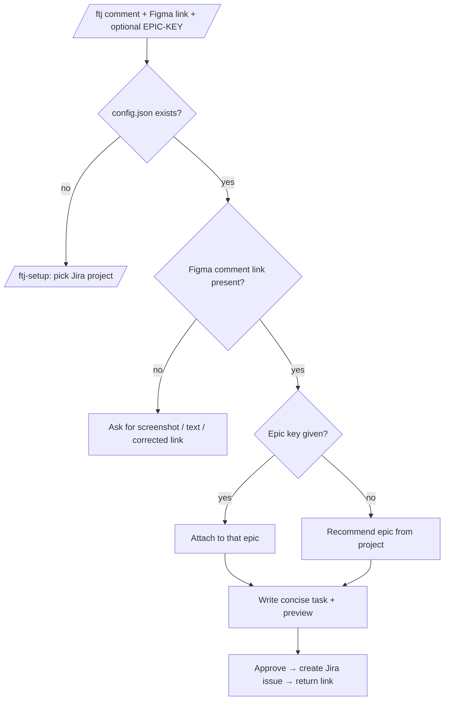

# figma-to-jira

A Claude Code plugin that turns a pasted Figma comment into a concise, well-formed Jira task.

## What & why

Design feedback lives in Figma comments. Turning that feedback into good Jira tasks is manual and inconsistent: someone rereads the thread, rewrites it as a user story, invents acceptance criteria, picks an issue type, finds the right epic, and pastes the Figma link back in. Everyone does it a little differently.

`figma-to-jira` collapses that into a single command. You paste the comment (or a screenshot) plus the Figma link, and the plugin drafts a concise, outcome-focused user story, shows you a preview, and — once you approve — creates the Jira issue through your own Atlassian connector and hands back the link. No secrets are shipped: Jira access is your per-user OAuth connection in Claude.

## How it works



## Requirements

- **Claude Code**.
- The **Atlassian connector** connected in Claude (Settings → Connectors → Atlassian). This provides per-user OAuth access to your Jira — the plugin ships no secrets.
- A **Jira project** you can create issues in.

## Install

```bash
/plugin marketplace add <org>/figma-to-jira
/plugin install figma-to-jira@figma-to-jira
```

> Replace `<org>` with the GitHub `owner/repo` for this repository once it is published.

## Setup

Run once per project:

```
/ftj-setup
```

`/ftj-setup` asks which Jira project to target and writes a config to `./.figma-to-jira/config.json` in the current repo.

The config is **per project**: run `/ftj-setup` once in each project/repo you file tasks from. Each project can target a different Jira project, so a mobile repo and a web repo can point at different Jira boards.

## Usage

```
/ftj <content> <figma-link> [EPIC-KEY]
```

The Figma link is required. Content can be a pasted comment, plain text, or a screenshot. An epic key is optional; if omitted, the plugin recommends one.

**Recommend an epic (no key given):**

```
/ftj <pasted comment> <figma link>
```

The plugin drafts the task and recommends a fitting epic from your Jira project.

**Attach directly to an epic:**

```
/ftj <figma link> SHELL-141 <pasted comment>
```

An epic key (matching `[A-Z][A-Z0-9]+-\d+`, e.g. `SHELL-141`) attaches the new task directly to that epic — no recommendation step.

**Screenshots:**

Paste an image together with the Figma link. The plugin reads the screenshot as the content.

If the content is missing, or the Figma link is missing or not a valid comment link, the plugin asks you for a screenshot, text, or a corrected link — and does **not** create a task until it has what it needs.

## What the task looks like

Each task is a concise, outcome-focused **user story**:

- **Title** — short and outcome-focused.
- **Description** — compact; no filler.
- **Acceptance criteria** — 2–4 checkable items.
- **Source** — the Figma link, so the design context is one click away.
- **Issue type** — `Story` by default.

You always see a preview and approve before anything is created in Jira.

## Configuration reference

`/ftj-setup` writes `./.figma-to-jira/config.json` in the current project:

```json
{
  "cloudId": "abc-123",
  "projectKey": "MOB",
  "projectName": "Mobile App",
  "defaultIssueType": "Story",
  "labels": ["figma"]
}
```

| Field | Meaning |
| --- | --- |
| `cloudId` | Your Atlassian site (cloud) identifier. |
| `projectKey` | Jira project key new issues are created in. |
| `projectName` | Human-readable project name (for previews). |
| `defaultIssueType` | Issue type for new tasks. Defaults to `Story`. |
| `labels` | Labels applied to every created issue. |

## Troubleshooting

- **Atlassian tools not found** — connect the Atlassian connector in Claude (Settings → Connectors → Atlassian).
- **Config missing** — run `/ftj-setup` in the current project.
- **Wrong project** — re-run `/ftj-setup` to point the project at a different Jira project.
- **No Figma link** — the plugin will ask for one; supply a valid Figma comment link.

## Publishing to the Future Mind marketplace

This repo can be added to Future Mind's official plugin marketplace in either of two ways:

- **Catalog entry** — add it as a plugin entry in the marketplace's `marketplace.json`.
- **GitHub source** — reference this repository directly as a `github` source.

## License

MIT — see [LICENSE](LICENSE).
